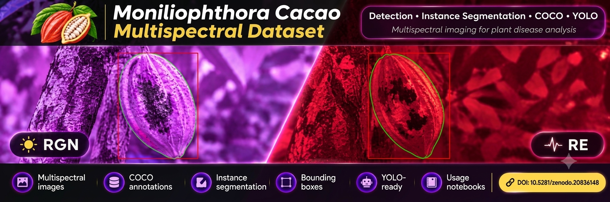

# Dataset Name

> One-sentence description of the dataset.

<p align="center">
  
</p>

<p align="center">

<!-- Badges -->
<a href="#"></a>
<a href="#"></a>
<a href="#"></a>
<a href="#"></a>
<a href="#"></a>

</p>

---

# 📖 Overview

Describe the dataset.

Explain:

- What it is.
- Why it was created.
- Main application.
- Associated publication.

---

# ✨ Features

- ✅ Multispectral images
- ✅ COCO annotations
- ✅ Instance segmentation
- ✅ Bounding boxes
- ✅ Ready for YOLO
- ✅ Google Colab notebooks

---

# 📥 Download

The dataset is available on Zenodo.

**DOI**

```
10.xxxx/zenodo.xxxxxxx
```

Download it from:

> https://doi.org/...

---

# 📂 Dataset Structure

```text
Dataset/

├── RE/
├── RGN/
├── annotations/
└── ...
```

Or include an image

```markdown

```

---

# 📊 Dataset Statistics

| Property | Value |
|-----------|------:|
| Images | |
| Classes | |
| Annotations | |
| Format | COCO |
| Bands | |

---

# 🏷 Classes

| ID | Class | Description |
|---:|--------|-------------|
| 1 | | |
| 2 | | |
| 3 | | |
| 4 | | |

---

# 🖼 Examples

Original image

Segmentation

Bounding boxes

Example images

---

# 🚀 Quick Start

## Clone repository

```bash
git clone https://github.com/username/repository.git
```

---

## Download dataset

Instructions...

---

## Open notebooks

```
notebooks/
```

---

# 📚 Notebooks

| Notebook | Description |
|-----------|-------------|
| 0 | Introduction |
| 1 | Download |
| 2 | Explore |
| 3 | Split |
| 4 | Data Augmentation |
| 5 | Prepare YOLO |

---

# ⚙ Workflow

```text
Zenodo
    │
    ▼
Download
    │
    ▼
Explore
    │
    ▼
Train / Validation / Test Split
    │
    ▼
Augmentation
    │
    ▼
YOLO Dataset
    │
    ▼
Training
```

---

# 📈 Results

(Optional)

Benchmark

Example results

Figures

---

# 📖 Citation

```bibtex
@dataset{
...
}
```

---

# 📜 License

Specify the license.

---

# 🙏 Acknowledgements

Funding

University

Collaborators

---

# 📧 Contact

Name

Institution

Email

LinkedIn
