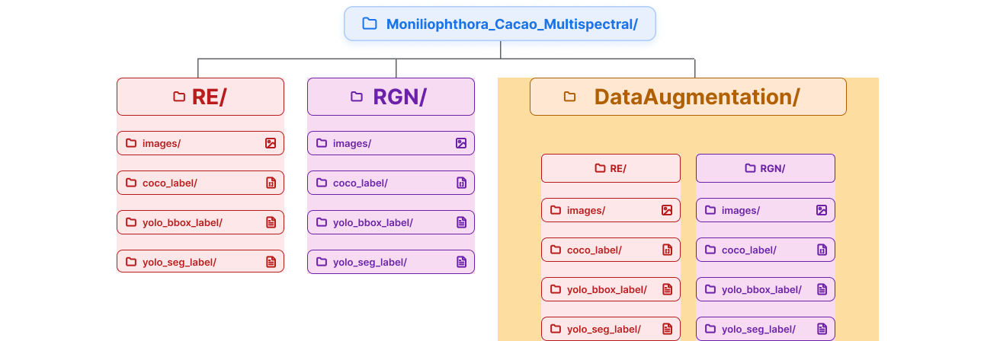

<h1 align="center">
Moniliophthora Cacao Multispectral
</h1>

<p align="center">
A public multispectral dataset for cacao pod detection and instance segmentation under real field conditions.
</p>

<p align="center">
  
</p>

<p align="center">

<a href="https://doi.org/10.5281/zenodo.20836148">
    
</a>

<a href="https://zenodo.org/records/20836148">
    
</a>

<a href="LICENSE">
    
</a>

<a href="#">
    
</a>

<a href="https://github.com/ultralytics/ultralytics">
    
</a>

<a href="#">
    
</a>

</p>

<p align="center">

<a href="https://colab.research.google.com/github/jorgedavid248961/Moniliophthora_cacao_multispectral/blob/main/MCM_Notebook.ipynb">

</a>

</p>

---

# 📖 Overview

The **Moniliophthora Cacao Multispectral Dataset (MCMD)** is a publicly available dataset designed for object detection and instance segmentation of cacao pods affected by *Moniliophthora* diseases under real field conditions.

The dataset contains multispectral imagery acquired in two spectral modalities (**RGN** and **Red Edge**) together with high-quality COCO annotations, including bounding boxes and instance segmentation masks. It is intended to support the development and evaluation of computer vision models for precision agriculture, plant disease detection, and automated crop monitoring.

In addition to the dataset, this repository provides documentation, reproducible notebooks, and utilities for data exploration, train/validation/test splitting, data augmentation, and preparation for YOLO-based training pipelines.

---

# ✨ Features

## ✨ Key Features

- 🌈 **Multispectral imagery:** Two spectral modalities are provided (**RGN** and **Red Edge**) to support research on spectral analysis for plant disease detection.

- 🎯 **High-quality annotations:** All images are manually annotated using the COCO format, including bounding boxes and instance segmentation masks.

- 🍫 **Real field conditions:** Images were acquired under natural illumination and field environments, providing realistic scenarios for computer vision applications.

- 🤖 **Deep learning ready:** Compatible with modern object detection and instance segmentation frameworks such as Ultralytics YOLO.

- 📚 **Reproducible workflow:** This repository includes Jupyter notebooks for dataset exploration, train/validation/test splitting, data augmentation, and YOLO dataset preparation.

- 📖 **Open access:** The dataset is publicly available through Zenodo and can be freely used for research and educational purposes according to its license.

---

# 📥 Download

The complete dataset is publicly available through **Zenodo**.

> **DOI:** 10.5281/zenodo.20836148

📦 **Dataset download:**

https://doi.org/10.5281/zenodo.20836148

This GitHub repository **does not host the dataset files**. Instead, it provides:

- 📖 Documentation
- 📚 Jupyter notebooks
- 🛠 Dataset preparation scripts
- 📊 Examples and visualizations
- 🤖 Utilities for YOLO training

The complete dataset, including multispectral images and COCO annotations, can be downloaded from Zenodo using the DOI above.

---

# 📂 Dataset Structure

<p align="center">
  
</p>

---

# 📊 Dataset Statistics

<!-- TODO: reemplaza los "—" con los valores reales del dataset (ver notebook 2 - Explore) -->

| Property | Value |
|-----------|------:|
| Images | — |
| Classes | — |
| Annotations | — |
| Format | COCO |
| Bands | — |

---

# 🏷 Classes

<!-- TODO: reemplaza con las clases reales anotadas en CVAT/COCO -->

| ID | Class | Description |
|---:|--------|-------------|
| 1 | | |
| 2 | | |
| 3 | | |
| 4 | | |

---

# 🖼 Examples

<!-- TODO: reemplaza las rutas de imagen con tus archivos reales en docs/ -->

| Original image | Segmentation | Bounding boxes |
|:---:|:---:|:---:|
|  |  |  |

---

# 🚀 Quick Start

## Clone repository

```bash
git clone https://github.com/jorgedavid248961/Moniliophthora_cacao_multispectral.git
cd Moniliophthora_cacao_multispectral
```

---

## Download dataset

1. Visita el registro del dataset en Zenodo: https://zenodo.org/records/20836148
2. Descarga el archivo comprimido del dataset.
3. Descomprímelo dentro de una carpeta `data/` en la raíz del repositorio (o ajusta las rutas dentro de los notebooks si usas otra ubicación).

---

## Open notebooks

```bash
jupyter notebook notebooks/
```

O ábrelos directamente en Google Colab usando el badge **"Open In Colab"** al inicio de este README.

---

# 📚 Notebooks

| Notebook | Description |
|-----------|-------------|
| 0 | Introduction |
| 1 | Download |
| 2 | Explore |
| 3 | Split |
| 4 | Data Augmentation |
| 5 | Prepare YOLO |

---

# ⚙ Workflow

```text
Zenodo
    │
    ▼
Download
    │
    ▼
Explore
    │
    ▼
Train / Validation / Test Split
    │
    ▼
Augmentation
    │
    ▼
YOLO Dataset
    │
    ▼
Training
```

---

# 📈 Results

_(Optional — completa esta sección cuando tengas resultados de benchmark que quieras publicar junto con el dataset.)_

<!-- TODO: agrega tablas de métricas (mAP, precision, recall) y figuras de resultados si aplica -->

---

# 📖 Citation

<!-- TODO: completa autores, año y título exactos que quieres usar en la cita -->

```bibtex
@dataset{moniliophthora_cacao_multispectral,
  author    = {},
  title     = {Moniliophthora Cacao Multispectral Dataset},
  year      = {2026},
  publisher = {Zenodo},
  doi       = {10.5281/zenodo.20836148},
  url       = {https://doi.org/10.5281/zenodo.20836148}
}
```

---

# 📜 License

This project is licensed under the **MIT License**. You are free to use, modify, and distribute this code and documentation, provided that the original copyright notice is retained.

<!-- TODO: agrega un archivo LICENSE en la raíz del repositorio con el texto completo de la licencia MIT -->

See the [LICENSE](LICENSE) file for full details.

---

# 🙏 Acknowledgements

<!-- TODO: confirma/completa institución, financiación y colaboradores -->

- **University:** Universidad EAFIT, Medellín, Colombia
- **Funding:** 
- **Collaborators:** 

---

# 📧 Contact

<!-- TODO: completa tus datos de contacto -->

- **Name:** 
- **Institution:** Universidad EAFIT
- **Email:** 
- **LinkedIn:**
